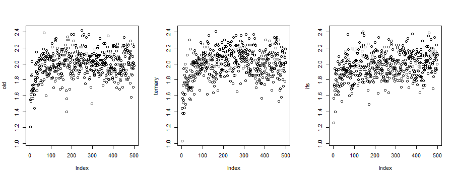
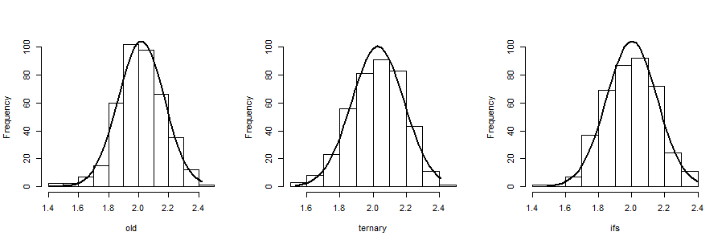
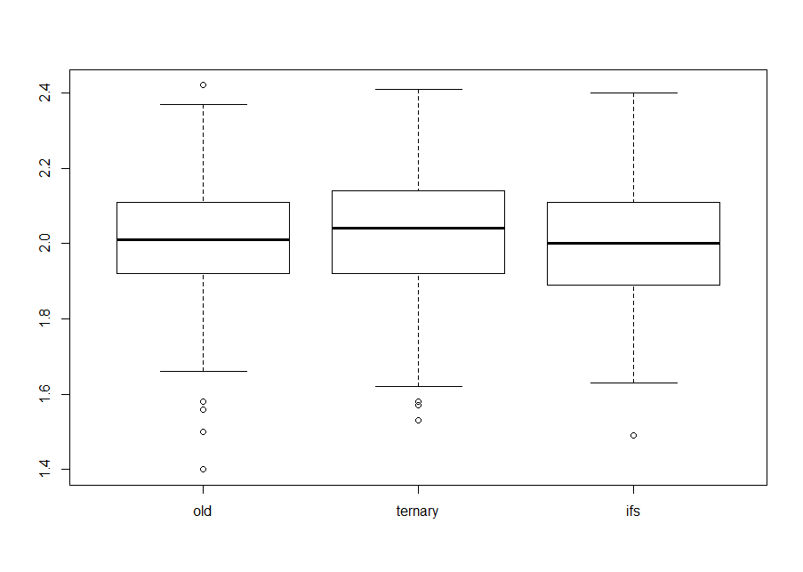
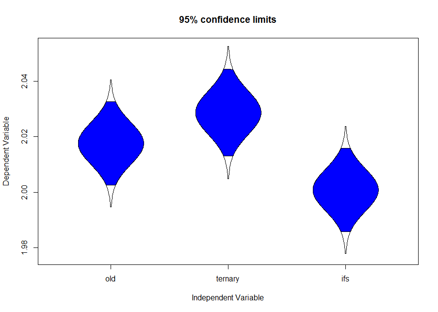
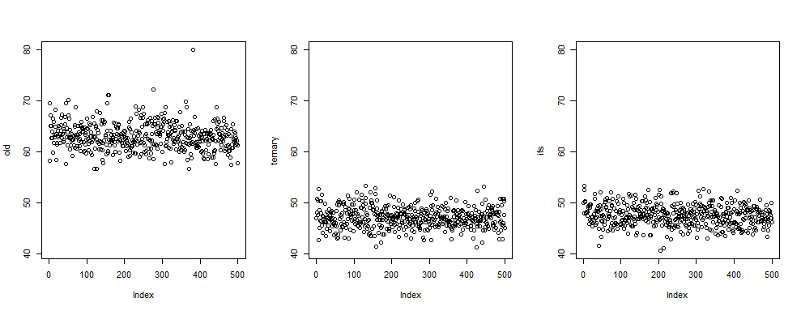
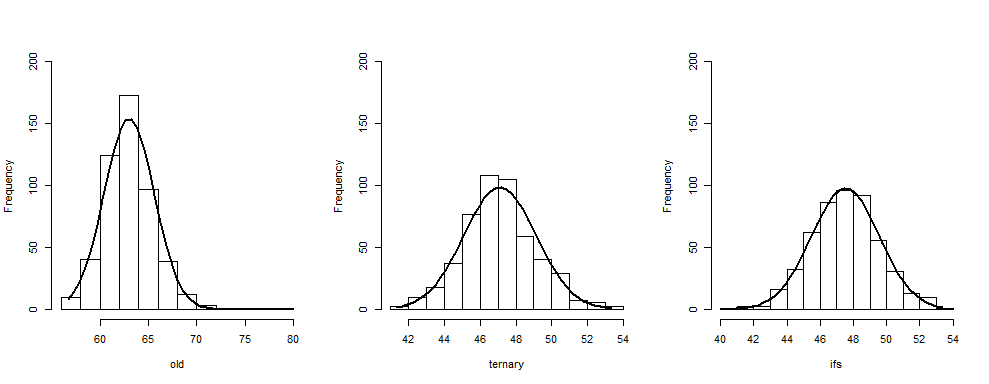
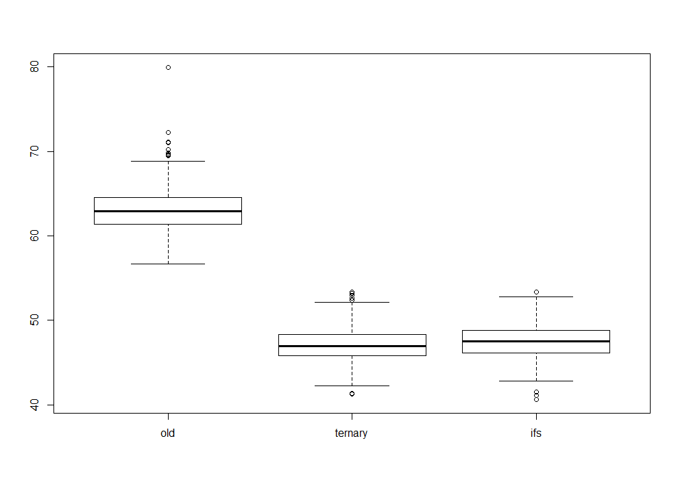
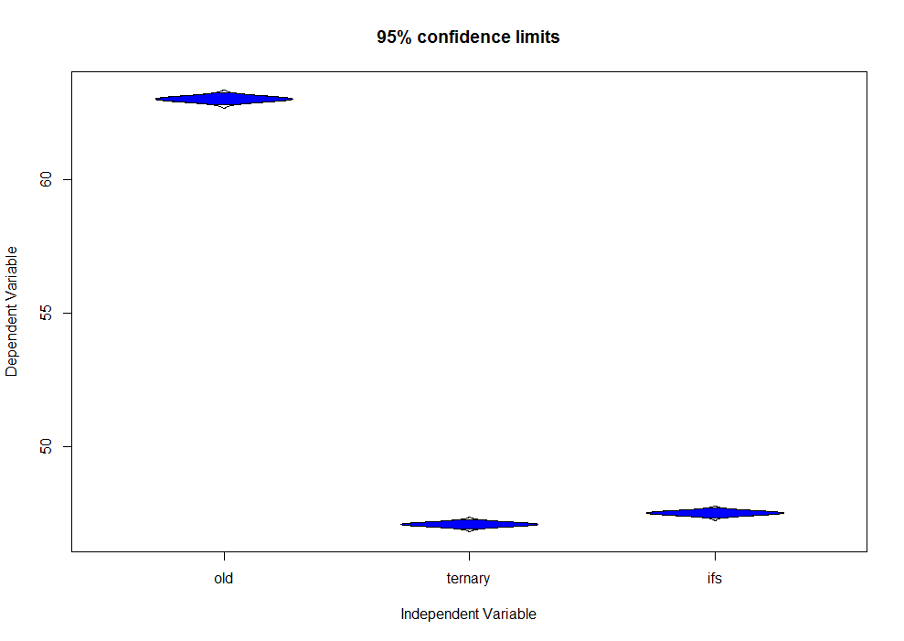
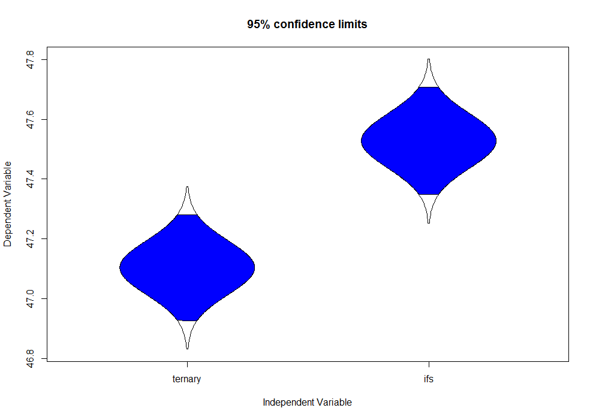

## Background

[Kestrel](https://github.com/aspnet/KestrelHttpServer) is an open-source multi-platform HTTP server library written in C# and based on libuv. It is used by ASP.NET Core. One of its goals is to have very low overhead, as shown by the simplest “plaintext” benchmark from TechEmpower.

One part of achieving this high performance is efficient parsing of HTTP headers. As part of this parsing, it is necessary to find the first occurrence of a certain character (e.g. a newline) in some string. This is done in part using the `System.Numerics.Vector<T>` type, whose operations compile to SIMD instructions. The set of SIMD operations available on `Vector<T>` is fairly limited, so in the end, the index is obtained using this code (further called “old”), which is located in [the `FindFirstByte` method](https://github.com/svick/KestrelHttpServer/blob/old/src/Microsoft.AspNetCore.Server.Kestrel/Internal/Infrastructure/MemoryPoolIterator.cs#L557-L564):

```c#
return (i << 3) +
    ((longValue & 0x00000000ffffffff) > 0
        ? (longValue & 0x000000000000ffff) > 0
            ? (longValue & 0x00000000000000ff) > 0 ? 0 : 1
            : (longValue & 0x0000000000ff0000) > 0 ? 2 : 3
        : (longValue & 0x0000ffff00000000) > 0
            ? (longValue & 0x000000ff00000000) > 0 ? 4 : 5
            : (longValue & 0x00ff000000000000) > 0 ? 6 : 7);
```

When compiled using the RuyJit compiler from .Net Core, this code performs three unpredictable conditional jumps:

```asm
00007FF8FA5429A9  shl         ecx,3  
00007FF8FA5429AC  mov         edx,0FFFFFFFFh  
00007FF8FA5429B1  and         rdx,rax  
00007FF8FA5429B4  test        rdx,rdx  
00007FF8FA5429B7  jg          00007FF8FA542A0B    ; jump 1
00007FF8FA5429B9  mov         rdx,0FFFF00000000h  
00007FF8FA5429C3  and         rdx,rax  
00007FF8FA5429C6  test        rdx,rdx  
00007FF8FA5429C9  jg          00007FF8FA5429EB    ; jump 1.1
00007FF8FA5429CB  mov         rdx,0FF000000000000h  
00007FF8FA5429D5  and         rax,rdx  
00007FF8FA5429D8  test        rax,rax  
00007FF8FA5429DB  jg          00007FF8FA5429E4    ; jump 1.1.1
00007FF8FA5429DD  mov         edx,7  
00007FF8FA5429E2  jmp         00007FF8FA542A47  
00007FF8FA5429E4  mov         edx,6  
00007FF8FA5429E9  jmp         00007FF8FA542A47  
00007FF8FA5429EB  mov         rdx,0FF00000000h  
00007FF8FA5429F5  and         rax,rdx  
00007FF8FA5429F8  test        rax,rax  
00007FF8FA5429FB  jg          00007FF8FA542A04    ; jump 1.1.2
00007FF8FA5429FD  mov         edx,5  
00007FF8FA542A02  jmp         00007FF8FA542A47  
00007FF8FA542A04  mov         edx,4  
00007FF8FA542A09  jmp         00007FF8FA542A47  
00007FF8FA542A0B  mov         rdx,rax  
00007FF8FA542A0E  and         rdx,0FFFFh  
00007FF8FA542A15  test        rdx,rdx  
00007FF8FA542A18  jg          00007FF8FA542A33    ; jump 1.2
00007FF8FA542A1A  and         rax,0FF0000h  
00007FF8FA542A20  test        rax,rax  
00007FF8FA542A23  jg          00007FF8FA542A2C    ; jump 1.2.1
00007FF8FA542A25  mov         edx,3  
00007FF8FA542A2A  jmp         00007FF8FA542A47  
00007FF8FA542A2C  mov         edx,2  
00007FF8FA542A31  jmp         00007FF8FA542A47  
00007FF8FA542A33  and         rax,0FFh  
00007FF8FA542A39  test        rax,rax  
00007FF8FA542A3C  jg          00007FF8FA542A45    ; jump 1.2.2
00007FF8FA542A3E  mov         edx,1  
00007FF8FA542A43  jmp         00007FF8FA542A47  
00007FF8FA542A45  xor         edx,edx  
00007FF8FA542A47  lea         eax,[rcx+rdx]  
00007FF8FA542A4A  add         rsp,30h  
00007FF8FA542A4E  pop         rsi  
00007FF8FA542A4F  ret  
```

Since the efficiency of this code should be important for the overall performance of the server (otherwise it would not be vectorized) and since the unpredictable conditional jumps can be replaced by much more efficient conditional moves, I set out to optimize this code.

I have written two versions of this code. [One using ternary operators](https://github.com/svick/KestrelHttpServer/commit/4f8cc5e22e360b8deccd30308ae9a4c34c52732b) (called “ternary”):

```c#
int result = i << 3;

var tmp1 = longValue & 0x00000000ffffffff;
result += tmp1 == 0 ? 4 : 0;
longValue = tmp1 == 0 ? longValue : tmp1;

var tmp2 = longValue & 0x0000ffff0000ffff;
result += tmp2 == 0 ? 2 : 0;
longValue = tmp2 == 0 ? longValue : tmp2;

var tmp3 = longValue & 0x00ff00ff00ff00ff;
result += tmp3 == 0 ? 1 : 0;

return result;
```

```asm
00007FF8FA5429A5  mov         edx,0FFFFFFFFh  
00007FF8FA5429AA  and         rdx,rax  
00007FF8FA5429AD  shl         ecx,3  
00007FF8FA5429B0  test        rdx,rdx  
00007FF8FA5429B3  je          00007FF8FA5429BA    ; jump 1  
00007FF8FA5429B5  xor         r8d,r8d  
00007FF8FA5429B8  jmp         00007FF8FA5429C0  
00007FF8FA5429BA  mov         r8d,4  
00007FF8FA5429C0  add         ecx,r8d  
00007FF8FA5429C3  test        rdx,rdx  
00007FF8FA5429C6  je          00007FF8FA5429CA    ; jump 1.1
00007FF8FA5429C8  jmp         00007FF8FA5429CD  
00007FF8FA5429CA  mov         rdx,rax  
00007FF8FA5429CD  mov         rax,rdx  
00007FF8FA5429D0  mov         rdx,0FFFF0000FFFFh  
00007FF8FA5429DA  and         rdx,rax  
00007FF8FA5429DD  test        rdx,rdx  
00007FF8FA5429E0  je          00007FF8FA5429E7    ; jump 1.1.1
00007FF8FA5429E2  xor         r8d,r8d  
00007FF8FA5429E5  jmp         00007FF8FA5429ED  
00007FF8FA5429E7  mov         r8d,2  
00007FF8FA5429ED  add         ecx,r8d  
00007FF8FA5429F0  test        rdx,rdx  
00007FF8FA5429F3  je          00007FF8FA5429F7    ; jump 1.1.1.1
00007FF8FA5429F5  jmp         00007FF8FA5429FA  
00007FF8FA5429F7  mov         rdx,rax  
00007FF8FA5429FA  mov         rax,0FF00FF00FF00FFh  
00007FF8FA542A04  and         rax,rdx  
00007FF8FA542A07  test        rax,rax  
00007FF8FA542A0A  je          00007FF8FA542A10    ; jump 1.1.1.1.1
00007FF8FA542A0C  xor         eax,eax  
00007FF8FA542A0E  jmp         00007FF8FA542A15  
00007FF8FA542A10  mov         eax,1  
00007FF8FA542A15  add         eax,ecx  
00007FF8FA542A17  add         rsp,30h  
00007FF8FA542A1B  pop         rsi  
00007FF8FA542A1C  ret 
```

[The other using `if`s](https://github.com/svick/KestrelHttpServer/commit/c91e78c0a9af7df63387088a20f602e66a10266f) (called “ifs”):

```c#
int result = i << 3;

var tmp1 = longValue & 0x00000000ffffffff;

if (tmp1 == 0)
    result += 4;
else
    longValue = tmp1;

var tmp2 = longValue & 0x0000ffff0000ffff;

if (tmp2 == 0)
    result += 2;
else
    longValue = tmp2;

var tmp3 = longValue & 0x00ff00ff00ff00ff;

if (tmp3 == 0)
    result += 1;

return result;
```

```asm
00007FF8FA522795  shl         ecx,3  
00007FF8FA522798  mov         edx,0FFFFFFFFh  
00007FF8FA52279D  and         rdx,rax  
00007FF8FA5227A0  test        rdx,rdx  
00007FF8FA5227A3  jne         00007FF8FA5227AA    ; jump 1
00007FF8FA5227A5  add         ecx,4  
00007FF8FA5227A8  jmp         00007FF8FA5227AD  
00007FF8FA5227AA  mov         rax,rdx  
00007FF8FA5227AD  mov         rdx,0FFFF0000FFFFh  
00007FF8FA5227B7  and         rdx,rax  
00007FF8FA5227BA  test        rdx,rdx  
00007FF8FA5227BD  jne         00007FF8FA5227C4    ; jump 1.1
00007FF8FA5227BF  add         ecx,2  
00007FF8FA5227C2  jmp         00007FF8FA5227C7  
00007FF8FA5227C4  mov         rax,rdx  
00007FF8FA5227C7  mov         rdx,0FF00FF00FF00FFh  
00007FF8FA5227D1  and         rax,rdx  
00007FF8FA5227D4  test        rax,rax  
00007FF8FA5227D7  jne         00007FF8FA5227DB    ; jump 1.1.1
00007FF8FA5227D9  inc         ecx  
00007FF8FA5227DB  mov         eax,ecx  
00007FF8FA5227DD  add         rsp,30h  
00007FF8FA5227E1  pop         rsi  
00007FF8FA5227E2  ret 
```

As you can see, the machine code for the two new versions is shorter than the original. But they still contain at least three unpredictable conditional jumps. This means it’s unlikely that the difference between the old code and the would be significant, but it still could be measurable. 

## Server throughput benchmark

ASP.NET Core has [a benchmarking suite](https://github.com/aspnet/benchmarks). Its “plaintext” scenario mostly measures the Kestrel server, which makes it ideal to measure the impact of my change in a close-to-real situation.

Following instructions of the benchmarking suite, I run the benchmark HTTP server, which uses a version of Kestrel compiled by me, using .Net Core:

```
dotnet run --configuration Release --scenarios [default]
```

To actually measure performance, the instructions recommend [the `wrk` tool] running on a separate machine. Since I do not have access to another machine on the same network, my measurements were performed on the same machine. To run `wrk`, I have used Ubuntu on Windows. The output of `wrk` looks like this:

```
Running 10s test @ http://localhost:5000/plaintext
  4 threads and 256 connections
  Thread Stats   Avg      Stdev     Max   +/- Stdev
    Latency   100.00ms   42.09ms 340.81ms   68.38%
    Req/Sec     1.59k   632.82     3.69k    68.71%
  62389 requests in 10.17s, 72.71MB read
Requests/sec:   6132.40
Transfer/sec:      7.15MB
```

To perform a more detailed analysis (which is necessary especially since the reported standard deviations are high), I ran `wrk` many times, each time for a short time (one second). Out of the reported metrics, I have chosen average requests per second per thread. The command used to collect data was:

```sh
for i in `seq 1 500`; do ./wrk -c 256 -t 4 -d 1 -s ./scripts/pipeline.lua http://localhost:5000/plaintext -- 16; done | grep 'Req/Sec' | cut -c 12-20 > data.txt
```

Scatter plots for the collected data:



Based on the scatter plots, approximately 100 data points at the start should be removed to account for warmup.

Histograms:



Histograms show that data has approximately normal distribution.

Boxplot, confidence intervals plot:





Based on the boxplot and the confidence intervals plot, it seems the changes do not affect overall throughput of the server.

## Microbenchmark

Measuring server throughput didn’t show any difference between the three versions of the code, but running the code in isolation could. For that purpose, I have created [a microbenchmark](microbenchmark) using Benchmark.Net (which handles measuring, warmup etc.). Inputs for the measured code are chosen pseudo-randomly (with fixed seed to ensure fairness) from a set of possible inputs.

Output from Benchmark.Net is:

```
Host Process Environment Information:
BenchmarkDotNet.Core=v0.9.9.0
OS=Windows
Processor=?, ProcessorCount=4
Frequency=2727538 ticks, Resolution=366.6310 ns, Timer=TSC
CLR=CORE, Arch=64-bit ? [RyuJIT]
GC=Concurrent Workstation
dotnet cli version: 1.0.0-preview2-003121

Type=FindFirstEqualByte  Mode=Throughput

     Method |     Median |    StdDev |         Q1 |         Q3 | CI 95% Lower | CI 95% Upper |
----------- |----------- |---------- |----------- |----------- |------------- |------------- |
     RunOld | 10.1309 us | 1.4272 us |  9.1399 us | 11.3290 us |   10.1690 us |   10.4626 us |
 RunTernary | 11.5348 us | 1.2640 us | 10.6658 us | 12.5776 us |   11.5449 us |   11.9730 us |
     RunIfs |  9.8325 us | 1.4302 us |  8.8774 us | 11.2474 us |   10.0255 us |   10.3069 us |
```

Based on these results, “ternary” is actually slower than “old”. On the other hand, there is no strong evidence proving whether “old” or “ifs” is faster.

## C++ microbenchmark

Since the original goal of improving performance using conditional moves was not fulfilled, I have also performed a microbenchmark on the same code using a compiler that can use conditional moves: Visual C++. The core code is almost the same as in the C# microbenchmark, the main difference is removing code related to `Vector<T>`. Measuring is done using `std::chrono::steady_clock`.

Generated machine code:

“old”:

```asm
00007FF66E6B1119  test        edx,edx  
00007FF66E6B111B  je          old+31h (07FF66E6B1141h)    ; jump 1
00007FF66E6B111D  test        dx,dx  
00007FF66E6B1120  je          old+1Ch (07FF66E6B112Ch)    ; jump 1.1
00007FF66E6B1122  xor         ecx,ecx  
00007FF66E6B1124  test        dl,dl  
00007FF66E6B1126  sete        cl                          ; cmov
00007FF66E6B1129  mov         eax,ecx  
00007FF66E6B112B  ret  
00007FF66E6B112C  test        rdx,0FF0000h  
00007FF66E6B1133  mov         ecx,0  
00007FF66E6B1138  setbe       cl                          ; cmov
00007FF66E6B113B  add         ecx,2  
00007FF66E6B113E  mov         eax,ecx  
00007FF66E6B1140  ret  
00007FF66E6B1141  mov         rax,0FFFF00000000h  
00007FF66E6B114B  mov         ecx,0  
00007FF66E6B1150  test        rax,rdx  
00007FF66E6B1153  jbe         old+5Bh (07FF66E6B116Bh)    ; jump 1.2
00007FF66E6B1155  mov         rax,0FF00000000h  
00007FF66E6B115F  test        rax,rdx  
00007FF66E6B1162  setbe       cl                          ; cmov
00007FF66E6B1165  add         ecx,4  
00007FF66E6B1168  mov         eax,ecx  
00007FF66E6B116A  ret  
00007FF66E6B116B  mov         rax,0FF000000000000h  
00007FF66E6B1175  test        rax,rdx  
00007FF66E6B1178  setbe       cl                          ; cmov
00007FF66E6B117B  add         ecx,6  
00007FF66E6B117E  mov         eax,ecx  
00007FF66E6B1180  ret  
```

“ternary”:

```asm
00007FF76BC21119  test        edx,edx  
00007FF76BC2111B  mov         ecx,edx  
00007FF76BC2111D  mov         r9d,edx  
00007FF76BC21120  mov         rax,0FFFF0000FFFFh  
00007FF76BC2112A  cmove       rcx,rdx               ; cmov
00007FF76BC2112E  mov         r10d,2  
00007FF76BC21134  mov         r8,rcx  
00007FF76BC21137  mov         edx,0  
00007FF76BC2113C  and         r8,rax  
00007FF76BC2113F  mov         rax,r8  
00007FF76BC21142  cmove       rax,rcx               ; cmov
00007FF76BC21146  mov         rcx,0FF00FF00FF00FFh  
00007FF76BC21150  test        rcx,rax  
00007FF76BC21153  mov         eax,edx  
00007FF76BC21155  mov         ecx,edx  
00007FF76BC21157  sete        al                    ; cmov
00007FF76BC2115A  test        r8,r8  
00007FF76BC2115D  cmove       ecx,r10d              ; cmov
00007FF76BC21161  add         eax,ecx  
00007FF76BC21163  mov         ecx,4  
00007FF76BC21168  test        r9,r9  
00007FF76BC2116B  cmove       edx,ecx               ; cmov
00007FF76BC2116E  add         eax,edx  
00007FF76BC21170  ret  
```

“ifs”:

```asm
00007FF71667111C  test        r8d,r8d  
00007FF71667111F  mov         eax,r8d  
00007FF716671122  mov         edx,4  
00007FF716671127  cmovne      r8,rax                ; cmov
00007FF71667112B  xor         ecx,ecx  
00007FF71667112D  test        rax,rax  
00007FF716671130  mov         rax,r8  
00007FF716671133  cmovne      edx,ecx               ; cmov
00007FF716671136  mov         rcx,0FFFF0000FFFFh  
00007FF716671140  and         rax,rcx  
00007FF716671143  cmovne      r8,rax                ; cmov
00007FF716671147  test        rax,rax  
00007FF71667114A  mov         rax,0FF00FF00FF00FFh  
00007FF716671154  lea         ecx,[rdx+2]  
00007FF716671157  cmovne      ecx,edx               ; cmov
00007FF71667115A  test        rax,r8  
00007FF71667115D  lea         eax,[rcx+1]  
00007FF716671160  cmovne      eax,ecx               ; cmov
00007FF716671163  ret  
```

In this case, the machine code for “old” contains two conditional jumps and one conditonal move, while the code for “ternary” and “ifs” contains no jumps, only five conditional moves.

Scatter plots for the collected data:



Based on the scatter plots, no data points need to be removed to account for warmup.

Histograms:



Histograms show that data has approximately normal distribution.

Boxplot, confidence intervals plot:







Based on the boxplot and the confidence intervals plot, “old” is clearly significantly worse than both new versions, which confirms that conditional moves make the code much more efficient.

Based on confidence intervals plot, “ternary” is better than “ifs”. I would have to perform further research to figure out what causes this difference.

## Machine used

Hardware:

* Intel Core i5-2300 CPU @ 2.80GHz
 * even though I have disabled all frequency scaling options in BIOS, CPU frequency keeps fluctuating anyway
* 32 KB L1D, 32 KB L1I, 256 KB L2, 6 MB L3 cache
* 8 GB DDR3 RAM, 665 MHz

Software:

* Windows 10
* .Net Core 1.0.0
